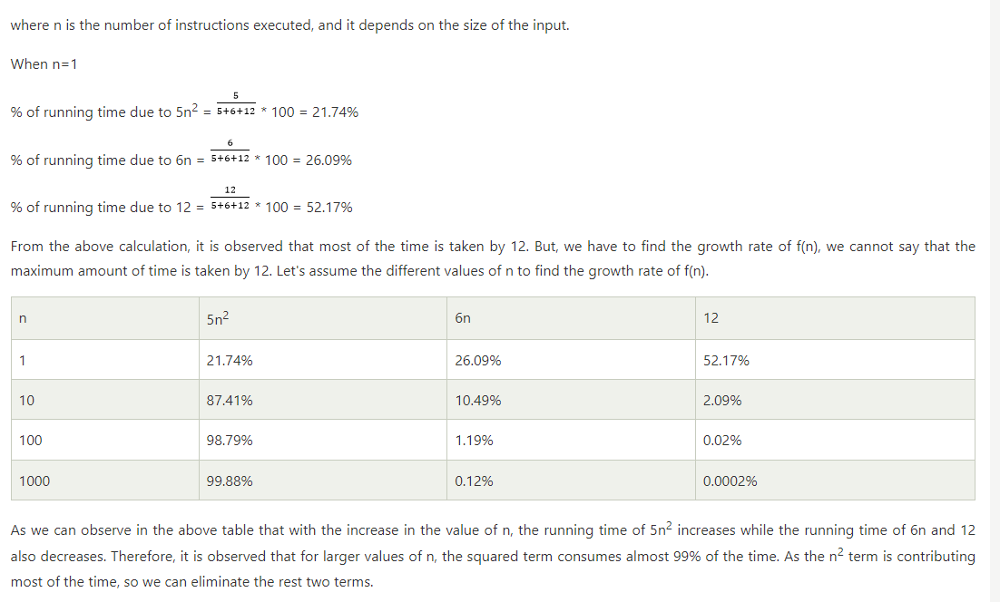

# Algorithm Complexity

+ Algorithm basics..
+ What is Algorithm complexity
  
## Time Complexity:
  - The time complexity is mainly calculated by counting the number of steps to finish the execution.

## Space Complexity:
  - Space complexity is the amount of spcae required to solve the problem
  - Space complexity = Auxilliary space + Input size.

## Big O Notation: Use to donate complexity (both)
  - Big O notation is a way to represent the complexity of an algorithm in terms of time and space.
  - Big O notation is used in Computer Science to describe the performance or complexity of an algorithm.
  - Big O notation is used to describe the worst-case scenario, and it can be used to describe the time or space complexity of an algorithm.

# Asymptotic analysis and notation

- `f(n) = 5n² + 6n + 12`
- What is Asymptotic Analysis?
  - Asymptotic analysis is the process of analyzing the running time of an algorithm as the input size increases.
  - Decide which algorithm is better than the other for program.
- How to calculate Time complexity
- Asymptotic Notations

Eg.    
    Time complexity is depend on the inputs (data).

    let x = [1,2,55,3,9,65];
    for example we want to sort this array. We apply for loop 

        for(.....) {

            for (.....) {

            }

            for(....) {

            }
        }

In this case it will take 6 line of code but to sort the array by looping 
    6 x 6  = 36  because the inputs are 6 and we apply loop 6 times.
    and our static line are 9 (for loop, if, else, function, etc.)

-> so, total line of code is **36 + 9 = 45**

If we have 1000 inputs then it will take 1000 x 1000 = 1000000 Hence, time complexity is depend on inputs.

if we have _10_ inputs, the function go like **f(10)**.

what if we don't know the inputs?

=> so, that why we use -> **f(n)**
=> f(n) = time complexity (T.C)

what if 10 inputs, in above example we have 10 inputs. We need **10 x 10** times to sort the array.

but, If we don't know the how inputs are there?
=> let take n numbers of inputs
    n x n = n²
To solve this problem we write 12 lines of code.

=> f(10) = 10 x 10 + 12

This is our equation for this ex. program.
=> f(10) = 10² + 12

So, 12 is static line of code. It's like constant, We need to remove it.

f(n) = n²

Let consider this formula -> `f(n) = 5n² + 6n + 12`

=> f(10) = 5 x 10² + 6 x 10 + 12

1. n is inputs
2. `n²` means n x n , you need loop inside loop (nested loops). That's why it's double
3. `5` means 5 lines/number of operations  in loop
4. `6n` means nedd 6 line with single outer loop.
5. Outside of the loop you need `12` lines.

e.g.
   - let x = [9, 0, 6, 7, 10]
    ....
    ....
    ....
    for(......) {
        ....
        for(.....) {
            ....
        }
    }
    
    ....
    ....
    ....

    for(.....) {

    }

    ....
    ....

f(5) = 5(5)² + 6(5) + 12
f(5) = 5 x 5² + 6 x 5 + 12
f(5) = 25 + 30 + 12
=> **f(5) = 67**

what if we have 100 inputs
f(100) = 5(100)² + 6(100) + 12
f(100) = 5 x 100² + 6 x 100 + 12

we consider the because if supriror/large, we remove other

f(100) = 50000

check this for to understand the equation with example 

# There are 3 type of Notation
  1. Big O Notation : to find out wrose case of alogorithm
  2. Omega Notation : to find out best case of alogorithm
  3. Theta Notation : to find out average case of alogorithm

