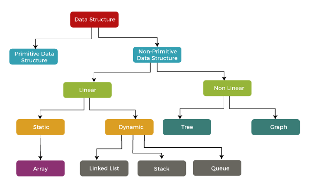

# Why use DSA?
- `DSA => Data + Structure + Algorithm`
- Optimized Performance
- Problem-solving
- Way to organize data so that we can use this data efficiently
    - e.g. [8,2,1,5,7,8,9,0]
        => **[0,1,2,5,7,8,9]**   

# What is Algorithm?
- A process or set of steps to accomplish a certain task

# How to start learning DSA?
The first and foremost thing is dividing the total procedure into little pieces which need to be done sequentially.

The complete process to learn DSA from scratch can be broken into 4 parts:

1. Learn about Time and Space complexities
2. Learn the basics of individual Data Structures
3. Learn the basics of Algorithms
4. Practice Problems on DSA

# How  many way / types  of data structure. 

1. Primitive Data Structure
  - int, float, char, double, boolean

2. Non-Primitive Data Structure
  - Array, Linked, Files
    1. Linear Lists
      - Stack
      - Queues 
    2. Non-Linear Lists
      - Trees
      - Graphs

*SEE THIS* -> 

# Differences between the primitive and non-primitive data structure.

|        Primitive data structure        |        Non-primitive data structure         |
| :------------------------------------: | :-----------------------------------------: |
| stores the data of (__only__) one type | store the data of (__more than__) one type. |
|        size depends on the type        |              size is not fixed              |
|  It starts with a lowercase character  |    It starts with an uppercase character    |
|    can be used to call the methods     |     cannot be used to call the methods      |
|                                        |                                             |

1. Linear List :
  Linear Data Structures are a type of data structure where data elements are arranged sequentially or linearly. Each element has a previous and next adjacent, except for the first and last elements.

2. Non-Linear List :
  Non-Linear Data Structures are a type of data structure where data elements are not arranged sequentially or linearly. Each element has a previous and next adjacent, except for the first and last elements. Data structures where data elements are not arranged sequentially or linearly are called non-linear data structures. In a non-linear data structure, single level is not involved. Therefore, we can’t traverse all the elements in single run only. Non-linear data structures are not easy to implement in comparison to linear data structure. It utilizes computer memory efficiently in comparison to a linear data structure. Its examples are (__trees__) and (__graphs__).

# Operation of Data structure:

   1. Traversal : To read the data from the data structure.
   2. Insertion : To add the data to the data structure.
   3. Deletion : To delete the data from the data structure.
   4. Searching : To search the data from the data structure.
   5. Sorting : To sort the data from the data structure.
   6. Merging : To merge the data from the data structure.

# What a kind of data structure is used 
    1. Array
    2. Stack
    3. Queue
    4. Tree 
    5. Graph
    6. Insertion
    7. Recursion
    8. Search
    9. Sorting
    10. Merge
    11. Map
    12. Set  

<!-- Array Question, Ask in insterview -->

## Q1. Array Traversing and Accessing
  - Make HTML page write basic  array
  - Travesing with loop
  - Accessing element
  - Acess element with text input and button
  - Validations

## Q2. Insert element in array
  - Understand issue and solution with whitboard
  - Make array, define the position
  - Use loop to insert new element
  - Inser element with text input and button
  - Insert element with any default function

## Q3. Delete element in array
  - Understand issue and solution with whitboard
  - Make array, define the position
  - Use loop to insert new element
  - Delete element with text input and button

## Q4. Search element in array (Linear search)
  - Understand case solution
  - Make array
  - Use loop to search element
  - Search element with text input and button
    - shortuct for search elemnet (Default function)
    - shortuct for delete elemnet (Default function)

## Q4. Merge Two array (Linear search)
  - Understand case solution
  - Make array
  - Use 2 Different loop to merge element
    - Shortcut for reverse array element (Default function)
    - Shortcut for merge array element (Default function)

## Q5. Merge Two array (While loop)
  - Understand case solution
  - Make three arrays
  - Use while loop to merge element
    - Compare the logic with last one - merge

# Space Complexity:
  - The more the data the more the space complexity.
  - eg.
    - If there is two program 1st take more space ex. 10kb and 2nd take less space ex. 5kb. Like if our system have only 100kb space then 2nd program will take lesser space than 1st. 2nd have good space complexity.

# Time Complexity:
  - The more the time the more the time complexity.
  - We can't directly calculate the time complexity. It's depend on 
    - processor
    - system 
    - how good is your system is depend on that
    - consider all scenarios, etc.
  - Depend on the number of lines.
    - The lesser the line of code the less the time complexity.
    - The more the line of code the more the time complexity.
  - We can calculate the time complexity with Big O notation.

