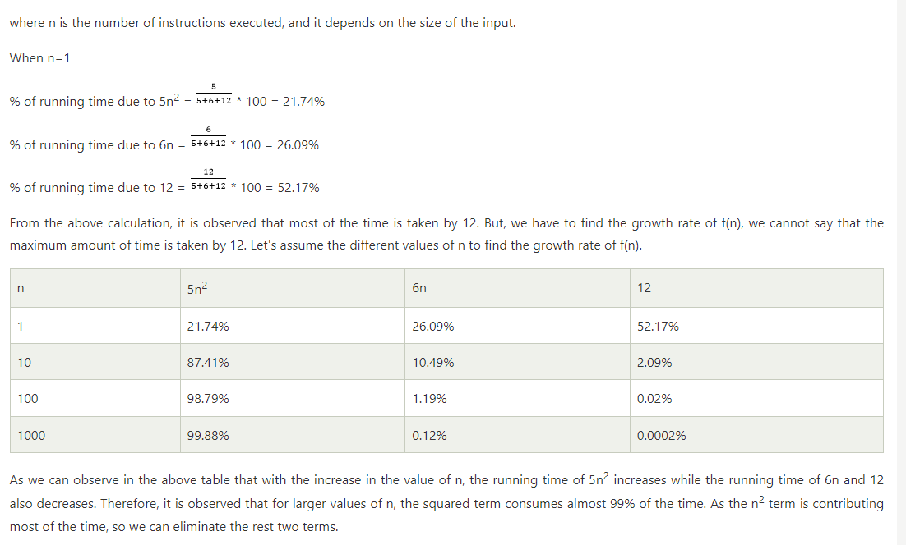

# Algorithm Complexity

+ Algorithm basics..
+ What is Algorithm complexity
  
## Time Complexity:
  - The time complexity is mainly calculated by counting the number of steps to finish the execution.

## Space Complexity:
  - Space complexity is the amount of spcae required to solve the problem
  - Space complexity = Auxilliary space + Input size.

## Big O Notation: Use to donate complexity (both)
  - Big O notation is a way to represent the complexity of an algorithm in terms of time and space.
  - Big O notation is used in Computer Science to describe the performance or complexity of an algorithm.
  - Big O notation is used to describe the worst-case scenario, and it can be used to describe the time or space complexity of an algorithm.

## Asymptotic analysis and notation

- `f(n) = 5n² + 6n + 12`
- What is Asymptotic Analysis?
  - Asymptotic analysis is the process of analyzing the running time of an algorithm as the input size increases.
  - Decide which algorithm is better than the other for program.
- How to calculate Time complexity
- Asymptotic Notations

Eg.    
    Time complexity is depend on the inputs (data).

    let x = [1,2,55,3,9,65];
    for example we want to sort this array. We apply for loop 

        for(.....) {

            for (.....) {

            }

            for(....) {

            }
        }

In this case it will take 6 line of code but to sort the array by looping 
    6 x 6  = 36  because the inputs are 6 and we apply loop 6 times.
    and our static line are 9 (for loop, if, else, function, etc.)

-> so, total line of code is **36 + 9 = 45**

If we have 1000 inputs then it will take 1000 x 1000 = 1000000 Hence, time complexity is depend on inputs.

if we have _10_ inputs, the function go like **f(10)**.

what if we don't know the inputs?

=> so, that why we use -> **f(n)**
=> f(n) = time complexity (T.C)

what if 10 inputs, in above example we have 10 inputs. We need **10 x 10** times to sort the array.

but, If we don't know the how inputs are there?
=> let take n numbers of inputs
    n x n = n²
To solve this problem we write 12 lines of code.

=> f(10) = 10 x 10 + 12

This is our equation for this ex. program.
=> f(10) = 10² + 12

So, 12 is static line of code. It's like constant, We need to remove it.

f(n) = n²

Let consider this formula -> `f(n) = 5n² + 6n + 12`

=> f(10) = 5 x 10² + 6 x 10 + 12

1. n is inputs
2. `n²` means n x n , you need loop inside loop (nested loops). That's why it's double
3. `5` means 5 lines/number of operations  in loop
4. `6n` means nedd 6 line with single outer loop.
5. Outside of the loop you need `12` lines.

Eg.

  let x = [9, 0, 6, 7, 10]

    ....
    ....
    ....
    for(......) {
        ....
        for(.....) {
            ....
        }
    }
    ....
    ....
    ....
    for(.....) {

    }
    ....
    ....

f(5) = 5(5)² + 6(5) + 12
f(5) = 5 x 5² + 6 x 5 + 12
f(5) = 25 + 30 + 12
=> **f(5) = 67**

what if we have 100 inputs
f(100) = 5(100)² + 6(100) + 12
f(100) = 5 x 100² + 6 x 100 + 12

we consider the because if supriror/large, we remove other

f(100) = 50000

check this for to understand the equation with example 

# There are 3 type of Notation
  1. Big O Notation : to find out wrose case of alogorithm
  2. Omega Notation : to find out best case of alogorithm
  3. Theta Notation : to find out average case of alogorithm

## Array Sorting
- Basic Understanding
- Understand solution
- Write code and understand step by step
- Interview Question

# Recursion Data Structure
- what is Recursion Data Structure
- Example.
- Interview Questions
- While loop with Array Strings

Let, break the Recursion,
- Re-cursion means
  - `Re` -  to repeat something.
  - `cursion` - in latin which means => to itself.

i.e let Apple as function

  functio Apple() {
    ......
    ......
  }

  Apple();

  this function get called one time. but if I called this function to itself then,

  function Apple() {
    ......
    ......
    Apple();
    .......
  }

  Apple()

from outside I called this function from outside one time but after that it goes inside and calling iteself recursively. which will create a infinite loop.
if we apply proper conditio when can do anything like searching, sorting, etc.

## Indirect Recursion
- What is Indirect Recursion Data Structure?
- Example
- Interview Question

Indirect recursion is a type of recursion where a function calls another function, which in turn calls the original function, either directly or indirectly. This creates a recursive loop, but the function does not call itself directly.

let see,

  function apple() {
    orange();
  }

  function orange() {
    apple();
  }

  apple();

in this scenario, when called apple then goes from apple to orange and orange to apple recursively and vice versa this called indirect recursion.

  function A(x) {
    if (x > 0) {
      B(x - 1);
    }
  }

  function B(y) {
    if (y > 0) {
      A(y - 1);
    }
  }

In this example, `A` calls `B`, and `B` calls `A`. This creates an indirect recursive loop. When `A` is called with a positive argument, it calls B with a smaller argument. `B` then calls `A` with an even smaller argument, and so on.

### Note:

  Indirect recursion can be more difficult to detect and debug than direct recursion, as the recursive call is not immediately apparent. However, it can also be a useful technique for solving certain types of problems.

  Here are some key characteristics of indirect recursion:

  1. **Indirect call:** A function calls another function, which in turn calls the original function.
  2. **Recursive loop:** The sequence of function calls forms a loop, where the original function is eventually called again.
  3. **No direct self-call:** The function does not call itself directly.

  Indirect recursion can be used in various scenarios, such as:

  1. **Mutual recursion:** Two or more functions call each other recursively.
  2. **Cooperative recursion:** Multiple functions work together to solve a problem, with each function calling others in a     recursive manner.
  3. **Dynamic programming:** Indirect recursion can be used to solve problems that involve breaking down a complex problem into smaller sub-problems.
    To avoid infinite loop

