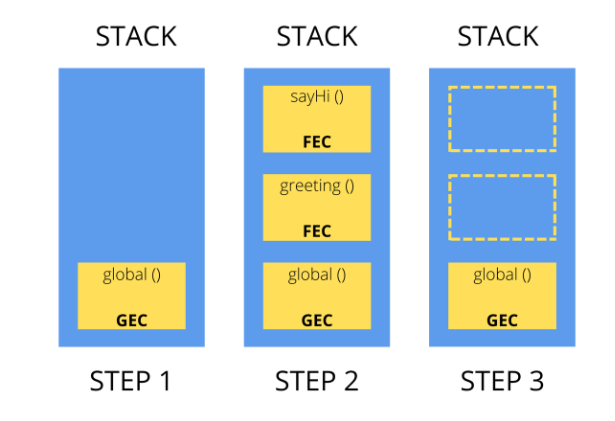

# Recursion Data Structure
- what is Recursion Data Structure
- Example.
- Interview Questions
- While loop with Array Strings

Let, break the Recursion,
- Re-cursion means
  - `Re` -  to repeat something.
  - `cursion` - in latin which means => to itself.

i.e let Apple as function

  function Apple() {
    ......
    ......
  }

  Apple();

  this function get called one time. but if I called this function to itself then,

  function Apple() {
    ......
    ......
    Apple();
    .......
  }

  Apple()

from outside I called this function from outside one time but after that it goes inside and calling iteself recursively. which will create a infinite loop.
if we apply proper conditio when can do anything like searching, sorting, etc.

## Indirect Recursion
- What is Indirect Recursion Data Structure?
- Example
- Interview Question

Indirect recursion is a type of recursion where a function calls another function, which in turn calls the original function, either directly or indirectly. This creates a recursive loop, but the function does not call itself directly.

let see,

  function apple() {
    orange();
  }

  function orange() {
    apple();
  }

  apple();

in this scenario, when called apple then goes from apple to orange and orange to apple recursively and vice versa this called indirect recursion.

  function A(x) {
    if (x > 0) {
      B(x - 1);
    }
  }

  function B(y) {
    if (y > 0) {
      A(y - 1);
    }
  }

In this example, `A` calls `B`, and `B` calls `A`. This creates an indirect recursive loop. When `A` is called with a positive argument, it calls B with a smaller argument. `B` then calls `A` with an even smaller argument, and so on.

### Note:

  Indirect recursion can be more difficult to detect and debug than direct recursion, as the recursive call is not immediately apparent. However, it can also be a useful technique for solving certain types of problems.

  Here are some key characteristics of indirect recursion:

  1. **Indirect call:** A function calls another function, which in turn calls the original function.
  2. **Recursive loop:** The sequence of function calls forms a loop, where the original function is eventually called again.
  3. **No direct self-call:** The function does not call itself directly.

  Indirect recursion can be used in various scenarios, such as:

  1. **Mutual recursion:** Two or more functions call each other recursively.
  2. **Cooperative recursion:** Multiple functions work together to solve a problem, with each function calling others in a     recursive manner.
  3. **Dynamic programming:** Indirect recursion can be used to solve problems that involve breaking down a complex problem into smaller sub-problems.
    To avoid infinite loop

# Q1. Head and Tail Recursion
- understand Debugger?
- How js works (Call Stack Main)
- Head recursion
- Tail Recursion

  function colors() {
    let data = 20;
    console.log("data:", data);
  }

  let take look at `Call Stack Main`:-

  function days() {
    colors();
  }

  function fruits() {
    days();
  }

  function topFunnction() {
    fruits();
  }

  topFunnction();

## what is the `Call Stack Main` ?

The call stack is used to manage the execution of functions in a program. When a function is called, a new entry is added to the top of the call stack, which includes the function's name, parameters, and local variables. When the function completes its execution, its entry is removed from the call stack.

e.g.

  function main() {
    console.log('Main function');
    foo();
  }

  function foo() {
    console.log('Foo function');
    bar();
  }

  function bar() {
    console.log('Bar function');
  }

  main();

  
In this example, the call stack would look like this:

1. `main()` is called, adding an entry to the call stack: `main`
2. `main()` calls foo(), adding an entry to the call stack: `main` -> `foo`
3. `foo()` calls `bar()`, adding an entry to the call stack: `main` -> `foo` -> `bar`
4. `bar()` completes its execution and is removed from the call stack: `main` -> `foo`
5. `foo()` completes its execution and is removed from the call stack: `main`
6. `main()` completes its execution and is removed from the call stack: (empty)

### why call stack is important to know?

The call stack is important for understanding how __JavaScript executes functions__ and manages scope. It's also useful for debugging, as it can help you understand the sequence of function calls that led to an error.

